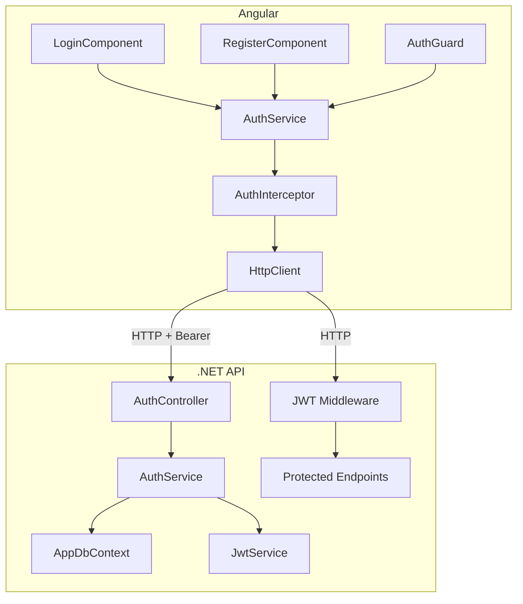

# Auth — Design

**Spec**: `.specs/features/auth/spec.md`
**Status**: Draft

---

## Architecture Overview



---

## Componentes

### Backend: `User` (entidade)

- **Purpose**: Entidade EF Core representando o usuário no banco
- **Location**: `backend/TodoBoard.Api/Models/User.cs`
- **Campos**: `Id`, `Username`, `PasswordHash`
- **Dependencies**: EF Core
- **Reuses**: padrão `AppDbContext` já criado

### Backend: `AuthController`

- **Purpose**: Expõe endpoints `POST /auth/register` e `POST /auth/login`
- **Location**: `backend/TodoBoard.Api/Controllers/AuthController.cs`
- **Interfaces**:
  - `POST /auth/register` → `RegisterRequest` → `201 Created` ou erro
  - `POST /auth/login` → `LoginRequest` → `{ token }` ou `401`
- **Dependencies**: `AuthService`
- **Reuses**: N/A

### Backend: `AuthService`

- **Purpose**: Lógica de registro (hash de senha) e login (validação + geração de JWT)
- **Location**: `backend/TodoBoard.Api/Services/AuthService.cs`
- **Interfaces**:
  - `RegisterAsync(username, password): Task<Result>`
  - `LoginAsync(username, password): Task<string?>`
- **Dependencies**: `AppDbContext`, `IConfiguration` (para chave JWT)
- **Reuses**: `AppDbContext`

### Frontend: `AuthService`

- **Purpose**: Gerenciar login, registro, logout e estado de autenticação
- **Location**: `frontend/src/app/core/services/auth.service.ts`
- **Interfaces**:
  - `login(username, password): Observable<void>`
  - `register(username, password): Observable<void>`
  - `logout(): void`
  - `isAuthenticated(): boolean`
  - `getToken(): string | null`
- **Dependencies**: `HttpClient`, `environment`, `Router`
- **Reuses**: `environment.apiUrl`

### Frontend: `AuthInterceptor`

- **Purpose**: Adicionar `Authorization: Bearer <token>` em todas as requisições; redirecionar para `/login` em 401
- **Location**: `frontend/src/app/core/interceptors/auth.interceptor.ts`
- **Interfaces**: `HttpInterceptorFn`
- **Dependencies**: `AuthService`, `Router`
- **Reuses**: padrão functional interceptor do Angular 17+

### Frontend: `AuthGuard`

- **Purpose**: Proteger rotas que exigem autenticação; redirecionar para `/login` se não autenticado
- **Location**: `frontend/src/app/core/guards/auth.guard.ts`
- **Interfaces**: `CanActivateFn`
- **Dependencies**: `AuthService`, `Router`
- **Reuses**: padrão functional guard do Angular 17+

### Frontend: `LoginComponent`

- **Purpose**: Tela de login com formulário de usuário e senha
- **Location**: `frontend/src/app/features/auth/login/login.component.ts`
- **Interfaces**: formulário reativo com `username` e `password`
- **Dependencies**: `AuthService`, `ReactiveFormsModule`
- **Reuses**: N/A

### Frontend: `RegisterComponent`

- **Purpose**: Tela de registro com formulário de usuário e senha
- **Location**: `frontend/src/app/features/auth/register/register.component.ts`
- **Interfaces**: formulário reativo com `username` e `password`
- **Dependencies**: `AuthService`, `ReactiveFormsModule`
- **Reuses**: padrão do `LoginComponent`

---

## Data Models

### Backend: `User`

```csharp
public class User
{
    public int Id { get; set; }
    public string Username { get; set; } = string.Empty;
    public string PasswordHash { get; set; } = string.Empty;
}
```

### Backend: DTOs

```csharp
public record RegisterRequest(string Username, string Password);
public record LoginRequest(string Username, string Password);
public record LoginResponse(string Token);
```

### Frontend: modelos

```typescript
interface LoginRequest {
  username: string;
  password: string;
}

interface LoginResponse {
  token: string;
}
```

---

## Tech Decisions

| Decisão | Escolha | Racional |
|---|---|---|
| Hash de senha | `BCrypt` (`BCrypt.Net-Next`) | Algoritmo seguro e simples de usar em .NET |
| Geração de JWT | `System.IdentityModel.Tokens.Jwt` | Pacote oficial Microsoft, já incluso no ASP.NET Core |
| Chave JWT | `appsettings.json → Jwt:Key` | Configuração por ambiente; não hardcodado no código |
| Expiração JWT | 8 horas | Suficiente para um dia de trabalho sem relogin |
| Armazenamento token Angular | `localStorage` | Simples para uso pessoal; risco de XSS aceitável neste contexto |
| Interceptor Angular | Functional interceptor (`HttpInterceptorFn`) | Padrão moderno do Angular 17+ — sem necessidade de classe |
| Guard Angular | Functional guard (`CanActivateFn`) | Padrão moderno do Angular 17+ |
| Formulários Angular | Reactive Forms | Mais controle para validação programática |

---

## Error Handling Strategy

| Cenário | Backend | Frontend |
|---|---|---|
| Username já existe | `409 Conflict` | Mensagem: "Nome de usuário já em uso" |
| Credenciais inválidas | `401 Unauthorized` | Mensagem: "Usuário ou senha incorretos" |
| Campos vazios | `400 Bad Request` | Validação no formulário antes de chamar a API |
| Token expirado | `401` na próxima requisição | Interceptor redireciona para `/login` |
| Senha < 6 caracteres | `400 Bad Request` | Validação no formulário + validação no backend |

---

## Packages a instalar

### Backend
```
BCrypt.Net-Next
Microsoft.AspNetCore.Authentication.JwtBearer
```

### Frontend
Nenhum pacote adicional — `HttpClient`, `ReactiveFormsModule` e `Router` já fazem parte do Angular.
