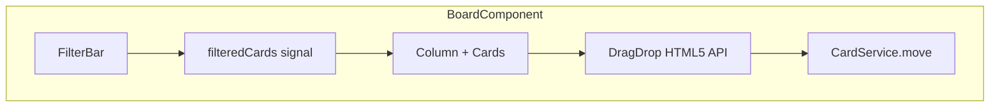

# Board Visual — Design

**Spec**: `.specs/features/board-visual/spec.md`
**Status**: Draft

---

## Architecture Overview



Tudo dentro do `BoardComponent` existente — sem novos componentes pesados. O drag-and-drop usa a **HTML5 Drag and Drop API nativa** (sem biblioteca externa), e os filtros são signals computados.

---

## Componentes

### `BoardComponent` — extensões

Adicionar ao `BoardComponent` existente:

**Drag-and-drop (HTML5 API nativa):**
- `draggable="true"` em cada card
- Evento `(dragstart)` — salva o `cardId` sendo arrastado
- Evento `(dragover)` — previne default para permitir drop, adiciona classe visual na coluna alvo
- Evento `(drop)` — lê o `cardId`, chama `CardService.move()`, atualiza signal local
- Evento `(dragleave)` / `(dragend)` — remove classe visual

**Filtros (signals computados):**
- `filterLabelId = signal<number | null>(null)`
- `filterPriority = signal<Priority | null>(null)`
- `filteredCards = computed(...)` — aplica ambos os filtros sobre `cards()`
- `cardsForColumn(columnId)` passa a usar `filteredCards()` em vez de `cards()`

### `FilterBarComponent` (inline no BoardComponent)

Barra de filtros no topo do board com:
- Select de etiqueta (opções: todas as etiquetas + "Todas")
- Select de prioridade (Todas / Baixa / Média / Alta)
- Botão "Limpar filtros"

---

## Tech Decisions

| Decisão | Escolha | Racional |
|---|---|---|
| Drag-and-drop | HTML5 API nativa | Zero dependência extra — Angular CDK DragDrop seria overkill para v1 |
| Estado do drag | `signal<number \| null>(draggingCardId)` | Simples, reativo, sem serviço extra |
| Feedback visual drag | Classe CSS `opacity-50` no card sendo arrastado | Simples e efetivo |
| Highlight da coluna alvo | Classe `ring-2 ring-blue-400` na coluna durante dragover | Visual claro do destino |
| Filtros | Computed signals no `BoardComponent` | Sem backend — filtro 100% no frontend, instantâneo |
| Rollback em erro | Reverter `cards` signal para estado anterior | Simples e confiável |

---

## Data Flow — Drag-and-drop

```
dragstart(cardId) 
  → draggingCardId.set(cardId)
  
dragover(event, columnId)
  → event.preventDefault()
  → dragOverColumnId.set(columnId)
  
drop(event, targetColumnId)
  → cardId = draggingCardId()
  → if card.columnId === targetColumnId → return (sem ação)
  → snapshot = cards() (para rollback)
  → cards.update() → mover card localmente (otimista)
  → CardService.move(cardId, targetColumnId)
      → sucesso: nada (já atualizado)
      → erro: cards.set(snapshot) (rollback)
  → draggingCardId.set(null)
  → dragOverColumnId.set(null)
```

---

## Error Handling

| Cenário | Handling |
|---|---|
| API falha no move | Rollback do signal `cards` para snapshot anterior |
| Drop na mesma coluna | Guard `if sourceColumnId === targetColumnId return` |
| Drag cancelado (fora da área) | `dragend` limpa `draggingCardId` e `dragOverColumnId` |
