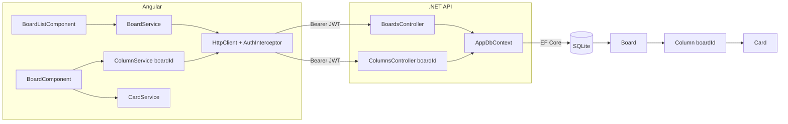

# Boards — Design

**Spec**: `.specs/features/boards/spec.md`
**Status**: Draft

---

## Architecture Overview



---

## Componentes

### Backend: `Board` (entidade)

- **Purpose**: Entidade que agrupa colunas e seus cards
- **Location**: `backend/TodoBoard.Api/Models/Board.cs`
- **Campos**: `Id`, `Name`, `Description?`, `CreatedAt`
- **Relacionamentos**: `ICollection<Column>` (cascade delete)

### Backend: `BoardsController`

- **Purpose**: CRUD de boards
- **Location**: `backend/TodoBoard.Api/Controllers/BoardsController.cs`
- **Interfaces**:
  - `GET /boards` → `200 [{ id, name, description, createdAt }]` ordenado por `createdAt` desc
  - `GET /boards/{id}` → `200 { board }`
  - `POST /boards` → `201 { board }` — cria board + seed das 3 colunas padrão
  - `PUT /boards/{id}` → `200 { board }` (renomear/editar)
  - `DELETE /boards/{id}` → `204` (cascade em colunas e cards via EF)
- **Dependencies**: `AppDbContext`
- **Reuses**: padrão `ColumnsController` (primary constructor, `[Authorize]`)

### Backend: `Column` (mudança)

- **Adicionar**: campo `BoardId` (int, FK para `Board`, non-nullable)
- **Relacionamento**: `Board Board { get; set; } = null!`
- **Migration**: `AddBoardEntity` — ver seção "Estratégia de Migração"

### Backend: `ColumnsController` (mudança)

- **`GET /columns`**: adicionar `[FromQuery] int boardId` como parâmetro **obrigatório** — filtra colunas pelo board
- **`POST /columns`**: adicionar `BoardId` no `ColumnRequest` — associa nova coluna ao board
- **`PUT /columns/{id}`**: sem mudança
- **`PATCH /columns/{id}/order`**: sem mudança (reordena dentro do board atual — a coluna já está vinculada)
- **`DELETE /columns/{id}`**: sem mudança
- **Unicidade de nome**: validação de nome duplicado passa a ser **por board** (não global)

### Backend: `ColumnSeeder` (remoção)

- **Remover** chamada do `Program.cs`
- Seed de colunas padrão passa a ocorrer dentro do `POST /boards`
- O arquivo `ColumnSeeder.cs` pode ser **deletado**

### Frontend: `BoardService`

- **Purpose**: Comunicação HTTP com a API de boards
- **Location**: `frontend/src/app/core/services/board.service.ts`
- **Interfaces**:
  - `getAll(): Observable<Board[]>`
  - `getById(id): Observable<Board>`
  - `create(data): Observable<Board>`
  - `update(id, data): Observable<Board>`
  - `delete(id): Observable<void>`
- **Reuses**: `environment.apiUrl`, `HttpClient` + `AuthInterceptor`

### Frontend: `BoardListComponent`

- **Purpose**: Tela inicial pós-login — lista de boards com ações de criar, renomear e excluir
- **Location**: `frontend/src/app/features/boards/board-list.component.ts`
- **Rota**: `/boards` protegida por `authGuard`
- **Dependencies**: `BoardService`, `ReactiveFormsModule`
- **Layout**:
  - Grid de cards de board (nome, descrição, data)
  - Botão "Novo Board" abre formulário inline/modal
  - Cada card tem botões Abrir, Renomear, Excluir
  - Estado vazio: "Nenhum board criado ainda" + botão Criar

### Frontend: `BoardComponent` (mudança)

- **Rota muda**: de `/board` para `/boards/:id`
- **Recebe `boardId`**: via `ActivatedRoute` (`route.snapshot.paramMap.get('id')`)
- **`ColumnService.getAll(boardId)`**: passa o `boardId` ao carregar colunas
- **`ColumnsManagerComponent`**: link "Gerenciar colunas" deve levar para `/columns?boardId={id}`

### Frontend: `ColumnService` (mudança)

- **`getAll(boardId: number)`**: adiciona `?boardId=` na query string
- **`create(name, boardId)`**: passa `boardId` no body
- Demais métodos: sem mudança

### Frontend: `ColumnsManagerComponent` (mudança)

- Recebe `boardId` via query param (`/columns?boardId=1`)
- Passa `boardId` ao `ColumnService.getAll()` e `create()`
- Botão "← Voltar" leva para `/boards/{boardId}`

### Frontend: Rotas (`app.routes.ts`) (mudança)

```
Antes:  '' → 'board'  |  'board' → BoardComponent
Depois: '' → 'boards' |  'boards' → BoardListComponent  |  'boards/:id' → BoardComponent
        '**' → 'boards'
```

---

## Estratégia de Migração (CRÍTICO — sem quebrar dados existentes)

A migration `AddBoardEntity` deve executar os seguintes passos **em ordem**:

1. Criar tabela `Boards` (`Id`, `Name`, `Description`, `CreatedAt`)
2. Inserir um board padrão: `INSERT INTO Boards (Name, CreatedAt) VALUES ('Meu Board', datetime('now'))`
3. Adicionar coluna `BoardId INTEGER NULL` na tabela `Columns`
4. Atualizar todos os registros existentes: `UPDATE Columns SET BoardId = (SELECT Id FROM Boards LIMIT 1)`
5. Alterar `BoardId` para `NOT NULL` (via nova migration ou script no `Up()`)

> **Por que nullable temporariamente?** SQLite não suporta `ALTER COLUMN`, então a migration EF Core gera uma recriação da tabela. O EF Core faz isso automaticamente ao definir `BoardId` como required com default value na migration.

**Implementação na migration EF Core**:

```csharp
protected override void Up(MigrationBuilder migrationBuilder)
{
    // 1. Criar tabela Boards
    migrationBuilder.CreateTable("Boards", ...);

    // 2. Inserir board padrão e capturar Id via SQL raw
    migrationBuilder.Sql(
        "INSERT INTO Boards (Name, Description, CreatedAt) VALUES ('Meu Board', NULL, datetime('now'))");

    // 3-5. Adicionar BoardId com default = primeiro board
    migrationBuilder.AddColumn<int>("BoardId", "Columns",
        defaultValueSql: "(SELECT Id FROM Boards LIMIT 1)", nullable: false);

    // 6. Criar FK depois dos dados estarem consistentes
    migrationBuilder.AddForeignKey("FK_Columns_Boards_BoardId", "Columns", "BoardId", "Boards",
        principalColumn: "Id", onDelete: ReferentialAction.Cascade);
}
```

---

## Data Models

### Backend: `Board`

```csharp
public class Board
{
    public int Id { get; set; }
    public string Name { get; set; } = string.Empty;
    public string? Description { get; set; }
    public DateTime CreatedAt { get; set; } = DateTime.UtcNow;
    public ICollection<Column> Columns { get; set; } = [];
}
```

### Backend: `Column` (atualizado)

```csharp
[Table("Columns")]
public class Column
{
    public int Id { get; set; }
    public string Name { get; set; } = string.Empty;
    public int Order { get; set; }
    public int BoardId { get; set; }          // NOVO
    public Board Board { get; set; } = null!; // NOVO
}
```

### Backend: DTOs

```csharp
public record BoardRequest(string Name, string? Description);

public record BoardResponse(int Id, string Name, string? Description, DateTime CreatedAt);

// ColumnRequest atualizado
public record ColumnRequest(string Name, int BoardId);
```

### Frontend

```typescript
export interface Board {
  id: number;
  name: string;
  description?: string;
  createdAt: string;
}

export interface BoardRequest {
  name: string;
  description?: string;
}
```

---

## Tech Decisions

| Decisão | Escolha | Racional |
|---|---|---|
| Cascade delete Board→Column→Card | Configurado via EF Core `OnDelete(DeleteBehavior.Cascade)` | Excluir um board remove tudo. Simples e sem lixo no banco |
| Seed das colunas padrão | Dentro do `POST /boards` | Cada board nasce com as 3 colunas; sem seeder global |
| Migration com board padrão | `INSERT` via `Sql()` na migration | Garante que dados existentes migram sem perda |
| `boardId` obrigatório em `GET /columns` | Query param required | Evita retornar colunas de todos os boards misturadas |
| BoardComponent recebe `boardId` via route param | `ActivatedRoute` | Permite compartilhar URL do board (ex: `/boards/2`) |
| Unicidade de nome de coluna por board | `AnyAsync(c => c.Name == name && c.BoardId == boardId)` | Dois boards podem ter coluna "A Fazer" sem conflito |
| BoardListComponent como tela inicial | Rota `''` → `'boards'` | Usuário vê seus boards antes de entrar em qualquer um |

---

## Error Handling

| Cenário | Backend | Frontend |
|---|---|---|
| Nome do board vazio | `400 Bad Request` | Validação no formulário |
| Nome duplicado (mesmo usuário) | `409 Conflict` | Mensagem "Board já existe" |
| Board não encontrado | `404 Not Found` | Redirect para `/boards` com toast de erro |
| Excluir board | Cascade automático | Modal de confirmação antes de prosseguir |
| `GET /boards/{id}` sem `boardId` válido | `404` | Redirect para `/boards` |
