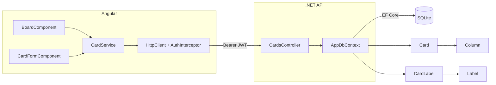

# Cards — Design

**Spec**: `.specs/features/cards/spec.md`
**Status**: Draft

---

## Architecture Overview



---

## Componentes

### Backend: `Card` (entidade)

- **Purpose**: Entidade principal do sistema
- **Location**: `backend/TodoBoard.Api/Models/Card.cs`
- **Campos**: `Id`, `Title`, `Description`, `DueDate?`, `Priority` (enum), `ColumnId`, `CreatedAt`
- **Relacionamentos**: `Column` (FK), `CardLabels` (coleção)

### Backend: `CardLabel` (entidade de junção)

- **Purpose**: Tabela de junção N:N entre `Card` e `Label`
- **Location**: `backend/TodoBoard.Api/Models/CardLabel.cs`
- **Campos**: `CardId`, `LabelId`

### Backend: `Priority` (enum)

- **Location**: `backend/TodoBoard.Api/Models/Priority.cs`
- **Valores**: `Low = 0`, `Medium = 1`, `High = 2`

### Backend: `CardsController`

- **Purpose**: CRUD completo + mover card entre colunas
- **Location**: `backend/TodoBoard.Api/Controllers/CardsController.cs`
- **Interfaces**:
  - `GET /cards?columnId={id}` → lista de cards com etiquetas
  - `POST /cards` → `201 { card }`
  - `PUT /cards/{id}` → `200 { card }`
  - `PATCH /cards/{id}/column` → `200`
  - `DELETE /cards/{id}` → `204`
- **Reuses**: padrão `LabelsController`

### Frontend: `CardService`

- **Location**: `frontend/src/app/core/services/card.service.ts`
- **Interfaces**:
  - `getByColumn(columnId): Observable<Card[]>`
  - `getAll(): Observable<Card[]>`
  - `create(data): Observable<Card>`
  - `update(id, data): Observable<Card>`
  - `move(id, columnId): Observable<void>`
  - `delete(id): Observable<void>`

### Frontend: `BoardComponent`

- **Purpose**: Tela principal — exibe todas as colunas com seus cards
- **Location**: `frontend/src/app/features/board/board.component.ts`
- **Reuses**: `ColumnService`, `CardService`, `LabelService`
- **Responsabilidade**: carrega colunas + cards, delega criação/edição ao `CardFormComponent`

### Frontend: `CardFormComponent`

- **Purpose**: Modal/painel de criação e edição de card
- **Location**: `frontend/src/app/features/board/card-form.component.ts`
- **Inputs**: `card?` (se passado = modo edição), `columns`, `labels`, `columnId` (pré-selecionado)
- **Outputs**: `saved`, `cancelled`
- **Reuses**: `ReactiveFormsModule`, `LabelService`, `ColumnService`

---

## Data Models

### Backend

```csharp
public enum Priority { Low = 0, Medium = 1, High = 2 }

public class Card
{
    public int Id { get; set; }
    public string Title { get; set; } = string.Empty;
    public string? Description { get; set; }
    public DateTime? DueDate { get; set; }
    public Priority Priority { get; set; } = Priority.Medium;
    public int ColumnId { get; set; }
    public Column Column { get; set; } = null!;
    public DateTime CreatedAt { get; set; } = DateTime.UtcNow;
    public ICollection<CardLabel> CardLabels { get; set; } = [];
}

public class CardLabel
{
    public int CardId { get; set; }
    public Card Card { get; set; } = null!;
    public int LabelId { get; set; }
    public Label Label { get; set; } = null!;
}
```

### Backend DTOs

```csharp
public record CardRequest(
    string Title,
    string? Description,
    DateTime? DueDate,
    Priority Priority,
    int ColumnId,
    List<int> LabelIds
);

public record MoveRequest(int ColumnId);

// Response com etiquetas expandidas
public record CardResponse(
    int Id, string Title, string? Description,
    DateTime? DueDate, Priority Priority,
    int ColumnId, DateTime CreatedAt,
    List<LabelDto> Labels
);

public record LabelDto(int Id, string Name, string Color);
```

### Frontend

```typescript
export type Priority = 'Low' | 'Medium' | 'High';

export interface CardLabel {
  id: number;
  name: string;
  color: string;
}

export interface Card {
  id: number;
  title: string;
  description?: string;
  dueDate?: string;
  priority: Priority;
  columnId: number;
  createdAt: string;
  labels: CardLabel[];
}

export interface CardRequest {
  title: string;
  description?: string;
  dueDate?: string;
  priority: Priority;
  columnId: number;
  labelIds: number[];
}
```

---

## Tech Decisions

| Decisão | Escolha | Racional |
|---|---|---|
| Priority como enum int | `Low=0, Medium=1, High=2` | Simples no SQLite, ordenável |
| CardLabel como entidade explícita | Chave composta `CardId+LabelId` | Necessário para EF Core mapear N:N sem tabela implícita |
| Response com labels expandidas | `CardResponse` com `List<LabelDto>` | Evita N+1 queries — carrega labels junto com o card |
| `GET /cards?columnId=` | Query param opcional | Flexível: pode carregar todos ou por coluna |
| `PATCH /cards/{id}/column` | Endpoint dedicado para mover | Semântica clara, consistente com colunas |
| BoardComponent carrega tudo | Colunas + todos os cards de uma vez | Simples para v1; otimização desnecessária |
| Bloquear exclusão de coluna com cards | Validação no `ColumnsController.Delete` | Integridade dos dados — cards órfãos são um problema |

---

## Error Handling

| Cenário | Backend | Frontend |
|---|---|---|
| Título vazio | `400` | Validação no formulário |
| ColumnId inexistente | `404` | Mensagem de erro no formulário |
| Card não encontrado | `404` | Mensagem inline |
| Coluna com cards ao excluir | `409 Conflict` | Mensagem "Remova os cards primeiro" |
