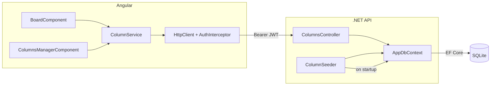

# Columns — Design

**Spec**: `.specs/features/columns/spec.md`
**Status**: Draft

---

## Architecture Overview



---

## Componentes

### Backend: `Column` (entidade)

- **Purpose**: Entidade EF Core representando uma coluna do board
- **Location**: `backend/TodoBoard.Api/Models/Column.cs`
- **Campos**: `Id`, `Name`, `Order` (int — posição no board)
- **Reuses**: padrão `AppDbContext`

### Backend: `ColumnSeeder`

- **Purpose**: Criar colunas padrão na inicialização se não existirem
- **Location**: `backend/TodoBoard.Api/Data/ColumnSeeder.cs`
- **Interfaces**: método estático `SeedAsync(AppDbContext db)`
- **Chamado em**: `Program.cs` após `app.Build()`, antes de `app.Run()`
- **Reuses**: `AppDbContext`

### Backend: `ColumnsController`

- **Purpose**: CRUD + reordenação de colunas via REST
- **Location**: `backend/TodoBoard.Api/Controllers/ColumnsController.cs`
- **Interfaces**:
  - `GET /columns` → `200 [{ id, name, order }]` ordenado por `order`
  - `POST /columns` → `201 { coluna }`
  - `PUT /columns/{id}` → `200 { coluna }` (renomear)
  - `PATCH /columns/{id}/order` → `200` (reordenar)
  - `DELETE /columns/{id}` → `204`
- **Dependencies**: `AppDbContext`
- **Reuses**: padrão `LabelsController` (primary constructor, `[Authorize]`)

### Frontend: `ColumnService`

- **Purpose**: Comunicação HTTP com a API de colunas
- **Location**: `frontend/src/app/core/services/column.service.ts`
- **Interfaces**:
  - `getAll(): Observable<Column[]>`
  - `create(name): Observable<Column>`
  - `rename(id, name): Observable<Column>`
  - `reorder(id, order): Observable<void>`
  - `delete(id): Observable<void>`
- **Reuses**: `environment.apiUrl`, `HttpClient` + `AuthInterceptor`

### Frontend: `ColumnsManagerComponent`

- **Purpose**: Tela de gerenciamento de colunas — lista, criar, renomear, reordenar, excluir
- **Location**: `frontend/src/app/features/columns/columns-manager.component.ts`
- **Rota**: `/columns` protegida por `authGuard`
- **Dependencies**: `ColumnService`, `ReactiveFormsModule`
- **Reuses**: padrão visual do `LabelsComponent`

---

## Data Models

### Backend: `Column`

```csharp
public class Column
{
    public int Id { get; set; }
    public string Name { get; set; } = string.Empty;
    public int Order { get; set; }
}
```

### Backend: DTOs

```csharp
public record ColumnRequest(string Name);
public record ReorderRequest(int Order);
```

### Frontend

```typescript
interface Column {
  id: number;
  name: string;
  order: number;
}
```

---

## Tech Decisions

| Decisão | Escolha | Racional |
|---|---|---|
| Seed de colunas | `ColumnSeeder` chamado no `Program.cs` | Simples, idempotente, sem migration de dados |
| Reordenação | `PATCH /columns/{id}/order` com swap de posições | Endpoint dedicado mantém semântica clara |
| Reordenação na UI | Botões ← → por coluna | Mais simples que drag-and-drop (que vem na Milestone 6) |
| Nome da entidade | `Column` com namespace para evitar conflito com SQL | SQLite reserva "column" — EF Core gera `[Column]` attribute ou usa nome da tabela `Columns` |
| Order no POST | Auto-calculado como `max(order) + 1` | Usuário não precisa informar a posição |

---

## Error Handling Strategy

| Cenário | Backend | Frontend |
|---|---|---|
| Name vazio | `400 Bad Request` | Validação no formulário |
| Name duplicado | `409 Conflict` | Mensagem "Coluna já existe" |
| Id não encontrado | `404 Not Found` | Mensagem de erro inline |
| Reorder inválido | Ignorado silenciosamente se já está na posição | N/A |
