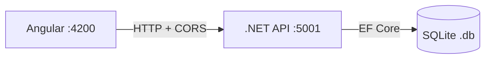

# Foundation — Design

**Spec**: `.specs/features/foundation/spec.md`
**Status**: Draft

---

## Architecture Overview

```
todo-board/
├── backend/          → .NET 9 Web API
│   ├── TodoBoard.Api/
│   │   ├── Controllers/
│   │   ├── Data/         → DbContext + Migrations
│   │   ├── Models/       → Entidades EF Core
│   │   └── Program.cs
│   └── TodoBoard.Api.csproj
│
└── frontend/         → Angular App
    ├── src/
    │   ├── app/
    │   │   ├── core/     → interceptors, guards, services base
    │   │   ├── shared/   → componentes reutilizáveis
    │   │   └── app.component.*
    │   ├── environments/ → environment.ts / environment.prod.ts
    │   └── styles.css    → imports TailwindCSS
    ├── tailwind.config.js
    └── angular.json
```

### Fluxo de comunicação



---

## Componentes

### Backend: `TodoBoard.Api`

- **Purpose**: Web API .NET 9 que expõe endpoints REST
- **Location**: `backend/TodoBoard.Api/`
- **Interfaces**:
  - `GET /health` → `200 OK` com mensagem de status
- **Dependencies**: ASP.NET Core, EF Core, SQLite provider
- **Reuses**: N/A (projeto novo)

### Backend: `AppDbContext`

- **Purpose**: Contexto do EF Core — ponto central de acesso ao banco SQLite
- **Location**: `backend/TodoBoard.Api/Data/AppDbContext.cs`
- **Interfaces**:
  - `DbSet<T>` para cada entidade (a ser adicionado nas próximas features)
- **Dependencies**: `Microsoft.EntityFrameworkCore`, `Microsoft.EntityFrameworkCore.Sqlite`
- **Reuses**: N/A

### Frontend: `Angular App`

- **Purpose**: SPA Angular servindo a interface do board
- **Location**: `frontend/`
- **Interfaces**:
  - `AppComponent` — root component com toggle de tema
  - `environment.ts` — variável `apiUrl` apontando para o backend
- **Dependencies**: Angular CLI, TailwindCSS
- **Reuses**: N/A (projeto novo)

### Frontend: `ThemeService`

- **Purpose**: Gerenciar o estado do tema dark/light e persistir no localStorage
- **Location**: `frontend/src/app/core/services/theme.service.ts`
- **Interfaces**:
  - `toggleTheme(): void`
  - `isDark$: Observable<boolean>`
- **Dependencies**: Angular, localStorage
- **Reuses**: N/A

---

## Data Models

Nenhuma entidade de negócio nesta fase. O `AppDbContext` será criado vazio, pronto para receber entidades nas próximas features.

---

## Tech Decisions

| Decisão | Escolha | Racional |
|---|---|---|
| Estrutura de pastas backend | Projeto único `TodoBoard.Api` | Projeto de estudo — sem necessidade de separar em múltiplos projetos/camadas agora |
| SQLite file location | Raiz do projeto backend | Simples para desenvolvimento local |
| Dark/light mode | Classe `dark` no `<html>` via TailwindCSS | Padrão recomendado pelo Tailwind — `darkMode: 'class'` no `tailwind.config.js` |
| Estado do tema | `localStorage` via `ThemeService` | Persiste preferência entre sessões sem backend |
| CORS em dev | `AllowAll` policy apenas em desenvolvimento | Não expor CORS aberto em produção |
| Ambiente Angular | `environment.ts` com `apiUrl` | Permite trocar URL da API sem mudar código |

---

## Error Handling Strategy

| Cenário | Handling | Impacto ao usuário |
|---|---|---|
| Backend fora do ar | `HttpClient` retorna erro — tratar no serviço Angular | Mensagem de erro na UI (a implementar nas features de negócio) |
| Arquivo `.db` não existe | EF Core cria automaticamente na migration | Transparente para o dev |
| Porta 5001 ocupada | .NET lança erro na inicialização | Dev vê no terminal — mudar porta no `launchSettings.json` |

---

## Packages a instalar

### Backend
```
Microsoft.EntityFrameworkCore.Sqlite
Microsoft.EntityFrameworkCore.Tools
Microsoft.EntityFrameworkCore.Design
```

### Frontend
```
tailwindcss
@tailwindcss/forms  (útil para estilizar inputs nos formulários futuros)
```
