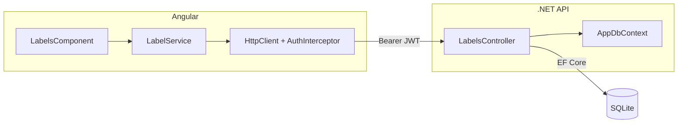

# Labels — Design

**Spec**: `.specs/features/labels/spec.md`
**Status**: Draft

---

## Architecture Overview



---

## Componentes

### Backend: `Label` (entidade)

- **Purpose**: Entidade EF Core representando uma etiqueta
- **Location**: `backend/TodoBoard.Api/Models/Label.cs`
- **Campos**: `Id`, `Name`, `Color` (hex string, ex: `#FF5733`)
- **Reuses**: padrão `AppDbContext`

### Backend: `LabelsController`

- **Purpose**: CRUD completo de etiquetas via REST
- **Location**: `backend/TodoBoard.Api/Controllers/LabelsController.cs`
- **Interfaces**:
  - `GET /labels` → `200 [ ]`
  - `POST /labels` → `201 { label }`
  - `PUT /labels/{id}` → `200 { label }`
  - `DELETE /labels/{id}` → `204`
- **Dependencies**: `AppDbContext`
- **Reuses**: padrão `AuthController` (primary constructor, `[Authorize]`)

### Frontend: `LabelService`

- **Purpose**: Comunicação HTTP com a API de etiquetas
- **Location**: `frontend/src/app/core/services/label.service.ts`
- **Interfaces**:
  - `getAll(): Observable<Label[]>`
  - `create(name, color): Observable<Label>`
  - `update(id, name, color): Observable<Label>`
  - `delete(id): Observable<void>`
- **Reuses**: `environment.apiUrl`, `HttpClient` + `AuthInterceptor` (já injetado globalmente)

### Frontend: `LabelsComponent`

- **Purpose**: Tela completa de gerenciamento de etiquetas (lista + formulário inline)
- **Location**: `frontend/src/app/features/labels/labels.component.ts`
- **Interfaces**:
  - Lista de etiquetas com preview de cor
  - Formulário de criação
  - Edição inline (clique no item → campos editáveis)
  - Confirmação de exclusão
- **Dependencies**: `LabelService`, `ReactiveFormsModule`
- **Reuses**: classes Tailwind já usadas no `LoginComponent`

---

## Data Models

### Backend: `Label`

```csharp
public class Label
{
    public int Id { get; set; }
    public string Name { get; set; } = string.Empty;
    public string Color { get; set; } = string.Empty;
}
```

### Backend: DTOs

```csharp
public record LabelRequest(string Name, string Color);
```

### Frontend

```typescript
interface Label {
  id: number;
  name: string;
  color: string; // hex, ex: "#FF5733"
}
```

---

## Tech Decisions

| Decisão | Escolha | Racional |
|---|---|---|
| Validação de cor | Regex `^#[0-9A-Fa-f]{6}$` no backend | Simples e suficiente para hex de 6 dígitos |
| Input de cor na UI | `<input type="color">` nativo do browser | Zero dependência extra — browser exibe color picker nativo |
| Edição | Inline na lista (não modal) | Mais simples, menos componentes |
| Rota da tela | `/labels` protegida por `authGuard` | Consistente com o padrão do projeto |
| Etiquetas são globais | Sem campo `userId` na entidade | App pessoal — único usuário |

---

## Error Handling Strategy

| Cenário | Backend | Frontend |
|---|---|---|
| Name vazio | `400 Bad Request` | Validação no formulário |
| Color inválida | `400 Bad Request` | Input type=color já garante hex válido |
| Name duplicado | `409 Conflict` | Mensagem "Etiqueta já existe" |
| Id não encontrado | `404 Not Found` | Mensagem de erro inline |
